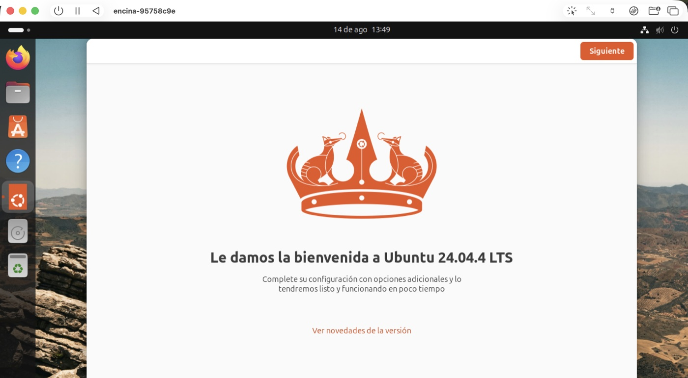
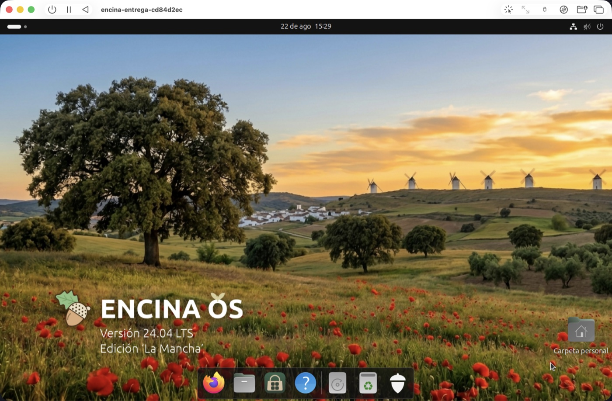

<p align="center">
  
</p>

<p align="center">
  <b>Una distribución derivada de Ubuntu con la firma digital española funcionando de fábrica.</b>
</p>

<p align="center">
  <a href="https://github.com/jmorenobl/encina-os/actions/workflows/build.yml"></a>
  <a href="LICENSE"></a>
  
  
  <a href="https://github.com/jmorenobl/encina-os/releases/tag/v0.2.1"></a>
</p>

<p align="center">
  <sub><b>Proyecto independiente.</b> Sin relación con la Administración General del Estado, la FNMT ni Canonical.<br>
  Derivado de Ubuntu; ni publicado ni avalado por Canonical Ltd.</sub>
</p>

---

## Qué es

Entrar en una sede electrónica con tu certificado, pulsar «Firmar» y que el
documento salga firmado. En Ubuntu recién instalado eso **no** funciona, y
arreglarlo a mano son cuatro cosas que hay que saber. En Encina OS viene hecho.

Es una distribución derivada de Ubuntu 24.04 LTS: la base de Ubuntu **sin
modificar**, cuatro paquetes encima y un instalador que los pone solo. Nada más.
Todo lo que hace está medido y escrito.

**Y es experimental, y conviene decirlo antes que nada.** `0.2.1` es la primera
versión que se publica, hecha y probada por una sola persona: `amd64` en un
portátil, `arm64` sólo en una máquina virtual. No la pongas como único sistema
de una máquina de la que dependas, **hoy no se actualiza** —una versión nueva es
reinstalar, y más abajo dice qué guardar antes—, y lee «El estado» antes de
grabar nada: ahí está lo que se ha comprobado de cada imagen y lo que no.

<p align="center">
  
  
</p>

<p align="center">
  <sub><b>El sistema ya instalado</b>, con <code>encina-branding</code> 0.1.13, en UTM arm64 el 2026-08-15.
  El fondo oscuro no es el claro atenuado: es el mismo paisaje de noche.<br>
  <b>Y el medio de instalación ya se ve así también</b>: el instalador sale con este paisaje detrás y termina diciendo
  «EncinaOS 24.04.4 LTS está instalado y listo para usarse» (<code>MEDICIONES.md</code> §4.63p).<br>
  En el dock de estas dos capturas sale la «A» naranja del Centro de aplicaciones: <b>desde la 0.1.15 lleva icono propio</b>
  (<a href="design/capturas/despues/07-icono-tienda-aplicaciones.png">se ve aquí</a>). El «?» de la ayuda se queda como está, a propósito.<br>
  Los originales, en <a href="design/capturas/fondo-0.1.13/">design/capturas/fondo-0.1.13/</a>; aquí van reducidas.
  La aprobación visual es <code>[OJOS]</code> y no la da un guion.</sub>
</p>

<p align="center">
  
  
</p>

<p align="center">
  <sub><b>La primera sesión, antes y después.</b> A la izquierda, lo primero que veía un desconocido:
  <b>una pantalla completa que dice «Ubuntu»</b>. A la derecha, la misma primera sesión en la máquina que sale
  del medio que se entrega —instalada desde <code>encina-os-libnss3.iso</code> el 2026-08-22 y verificada dentro
  con <b>63 correctas y 0 fallos</b>—: entra <b>directa al escritorio</b>.<br>
  Las seis del par completo, en <a href="design/capturas/despues/entrega-cd84d2ec/">design/capturas/despues/entrega-cd84d2ec/</a>,
  con el control de dos pasadas. Aquí van recortadas por arriba —esa franja es la barra de UTM, no el producto— y reducidas.<br>
  <b>Aprobadas por Jorge el 2026-08-22</b>, con dos salvedades escritas: el recuadro de usuario de GDM
  <b>sigue siendo naranja</b> y se acepta como mal menor, y <b>Plymouth no se ve</b> en la máquina virtual —la pantalla está apagada todo el
  arranque—. <b>En hierro sí se ve</b> (Acer Aspire ES1-524, 2026-08-23, <code>MEDICIONES.md</code> §4.70a), y el hierro sacó lo que la
  máquina virtual no podía: en ese AMD el saludador moría al cargar <code>amdgpu</code>; <code>encina-branding</code> 0.1.16 lo cierra
  desde el paquete, 3 de 3 arranques (§4.73, §4.78).</sub>
</p>

## Cómo probarlo

**Hay imagen que descargar desde el 2026-08-29.** Dos, una por arquitectura, en
SourceForge, con su huella al lado; los `.torrent` (con *web seed*, sin
tracker), las cosechas para reproducirla y las notas están en la
[release `v0.2.1`](https://github.com/jmorenobl/encina-os/releases/tag/v0.2.1)
de este repositorio, atados al commit.

| | Descarga | SHA-256 |
|---|---|---|
| **arm64** | [`encina-os-arm64.iso`](https://downloads.sourceforge.net/project/encina-os/0.2.1/encina-os-arm64.iso) · [torrent](https://downloads.sourceforge.net/project/encina-os/0.2.1/encina-os-arm64.iso.torrent) | `63f360dd755251d10628e71405235979b5b5e13ebf43d9f7e089ecbc2563a1f5` |
| **amd64** | [`encina-os-amd64.iso`](https://downloads.sourceforge.net/project/encina-os/0.2.1/encina-os-amd64.iso) · [torrent](https://downloads.sourceforge.net/project/encina-os/0.2.1/encina-os-amd64.iso.torrent) | `3d5d12a9bda400685beedabf9c1dd4ddde512e419866174b0bb6da7847f801f0` |
| las dos, y todo lo demás | [`SHA256SUMS`](https://downloads.sourceforge.net/project/encina-os/0.2.1/SHA256SUMS) | |

**Comprueba la huella antes de grabar nada** (`shasum -a 256 -c SHA256SUMS` en
macOS, `sha256sum -c SHA256SUMS` en Linux): una ISO sin huella al lado no se la
puedes dar a nadie. Lo que trae, lo que no —exige red al instalar, Secure Boot
no demostrado— y cómo reproducirla byte a byte están en las notas de la
release. Es una distribución derivada de Ubuntu; ni publicada ni avalada por
Canonical.

**Las dos imágenes son el producto, y no se han probado igual.** Esto es la
línea base de `0.2.1`: exactamente lo que se ha comprobado de cada una, para
que sepas qué te llevas.

| | Dónde se ha instalado | Qué se comprobó |
|---|---|---|
| **amd64** `3d5d12a9…` | **En hierro**: un Acer Aspire ES1-524 (AMD A9), desde un pincho USB, **sin red**, contestando las pantallas del instalador | El verificador dentro, como root: **65 correctas, 0 fallos** (`MEDICIONES.md` §4.78); arranca tres veces seguidas con saludador (§4.73); mirado en pantalla por Jorge |
| **arm64** `63f360dd…` | **Sólo en máquina virtual** (UTM sobre Apple Silicon). No hay otra máquina ARM donde probarla, y se publica **a sabiendas** de eso | Cinco pantallas contestadas, **65 / 0** dentro, y seis capturas aprobadas por Jorge (§4.79). En hierro ARM, nada |

Lo que queda por mirar, y en cuál de las dos, está en
[tareas/ojos.md](tareas/ojos.md): son miradas de una persona a la pantalla, se
listan y no se cuentan como aprobadas.

Lo que puedes hacer sin bajar nada, si quieres verlo construir:

```bash
git clone https://github.com/jmorenobl/encina-os
cd encina-os
./scripts/preparar-entorno.sh          # comprueba que tienes con qué construir
./scripts/construir-branding.sh        # construye encina-branding
```

Y si lo que quieres es entender por qué no funcionaba y cómo se arregló, eso
está entero en [ENCINA-OS.md](ENCINA-OS.md) y [MEDICIONES.md](MEDICIONES.md).

## El estado, por delante y sin letra pequeña

Esto no son defectos: es dónde está el proyecto hoy. Lo que falta está en
[TAREAS.md](TAREAS.md) con su motivo.

| | Hoy | Cuándo |
|---|---|---|
| **Versión** | **`0.2.1`, la primera publicada, y experimental.** El número es el de `encina-meta`, el paquete que declara de qué se compone el producto; la base es Ubuntu 24.04 LTS y no flota: cada imagen lleva una ISO oficial concreta, anclada por huella y conservada con la firma de Canonical (`MEDICIONES.md` §4.83) | Una versión nueva es un medio nuevo, con su carpeta y su etiqueta; nada publicado cambia |
| **Arquitectura** | **Dos, `arm64` y `amd64`, y las dos son el producto** (decisión de Jorge, 2026-08-30, `ENCINA-OS.md` D9). `amd64` probada en hierro; `arm64` sólo en máquina virtual, porque no hay otra máquina Apple Silicon | Las dos publicadas el 2026-08-29 |
| **Actualizaciones** | **No soportadas.** La base de Ubuntu se actualiza sola —**menos Firefox, que hay que actualizar a mano o desde «Actualización de software»** (medido, `MEDICIONES.md` §4.84)—; los cuatro paquetes de Encina **no tienen canal**, y el salto a la siguiente Ubuntu no está medido | Ver «Actualizar», justo debajo. Un repositorio en red firmado está en [tareas/actualizacion.md](tareas/actualizacion.md), con su precio |
| **Marca** | **El sistema instalado y el medio tienen cara propia** —fondos, GDM, arranque, la bellota en la rejilla, el Centro de aplicaciones con su icono, y el instalador con el paisaje de Encina y su nombre—. Lo que sigue diciendo Ubuntu está listado: `ID=ubuntu` en `os-release` (a propósito, `ENCINA-OS.md` D22), el splash del `initrd` del medio y los logotipos dentro del snap del instalador | [tareas/marca-del-medio.md](tareas/marca-del-medio.md) y [tareas/identidad-instalada.md](tareas/identidad-instalada.md) |
| **Instalación** | El núcleo de Ubuntu no viaja en el medio. En `amd64`, en hierro, **la instalación sin red terminó y la máquina funciona** (§4.78); en `arm64` sin red no está medido: ten red a mano | Meter el núcleo cuesta 1 089 MB y es decisión de producto, no deuda ([tareas/despues-de-publicar.md](tareas/despues-de-publicar.md)) |
| **Certificado** | Software, de la FNMT | DNIe con lector: incremento futuro |
| **Navegador** | Firefox | Chrome y Chromium no se han medido; no los des por buenos |
| **Secure Boot** | No se puede demostrar aquí | Límite declarado: el banco de pruebas no lo aplica |

## Actualizar: de momento, no hay camino

Tres cosas distintas se llaman «actualizar», y conviene no mezclarlas:

| | Qué es | Hoy |
|---|---|---|
| **La base** | Los parches de Ubuntu 24.04 LTS: seguridad, núcleo, escritorio | **Llegan solos**, como en cualquier Ubuntu: la base va sin modificar y eso es lo que compra ser derivada y no un *fork* (`ENCINA-OS.md` D3). Está medido que dos `sudo apt full-upgrade` seguidos no devuelven el Snap de Firefox. **Con una excepción, medida el 2026-08-31 (`MEDICIONES.md` §4.84): Firefox no.** Viene del repositorio de Mozilla y las actualizaciones automáticas de Ubuntu no lo tocan («pkg firefox is not in an allowed origin»); sus parches de seguridad llegan cuando abres «Actualización de software» y aceptas, o con `sudo apt full-upgrade`. Hazlo con regularidad. Cerrarlo para que lleguen solos es la casilla C-bis de [tareas/actualizacion.md](tareas/actualizacion.md), la primera del bloque |
| **Los paquetes de Encina** | `encina-branding`, `encina-firefox-native`, `encina-meta`, `autofirma` | **No se actualizan.** Viajan en el medio y quedan en un repositorio local de la máquina (`/srv/encina-repo`); no hay ningún repositorio en red que los sirva. Una versión nueva de Encina OS es **un medio nuevo, y se instala reinstalando** |
| **La Ubuntu siguiente** (26.04) | `do-release-upgrade` | **No medido.** No lo hagas esperando que Encina sobreviva: hay motivos escritos para pensar que el salto desactiva el repositorio de Mozilla y devuelve el Snap. Se medirá cuando Canonical ofrezca el salto; hoy (2026-08-30) no lo ofrece |

**Así que, si sale una versión nueva y la quieres, hoy el camino es
reinstalar.** Antes de hacerlo, guarda fuera de la máquina:

- **Tus certificados.** El fichero `.p12`/`.pfx` con el que los importaste, si
  lo conservas; si no, expórtalos desde Firefox (Ajustes → Privacidad y
  seguridad → Certificados → Ver certificados → Sus certificados), que es
  donde viven, en su perfil dentro de `~/.mozilla/firefox/`. *Ese paso es de
  Firefox y no está medido aquí.*
- **Tus documentos.** Tu carpeta personal, o lo que quieras conservar de ella.
- **La lista de lo que instalaste**, para volver a ponerlo después:
  `apt-mark showmanual > aplicaciones-apt.txt` y
  `snap list > aplicaciones-snap.txt`.

Esto está escrito y **no hecho**: un guion de respaldo y restauración que lo
haga solo, y que se mida con un certificado cargado —firmar antes, reinstalar,
restaurar, firmar después—, es una casilla de
[tareas/actualizacion.md](tareas/actualizacion.md). Y que Encina OS se actualice
sola está allí también, con lo que cuesta.

## Qué trae puesto

Una instalación de Encina OS sale con esto, y **sin que nadie toque nada**:

- **AutoFirma 1.9.1** parcheado para que funcione con el Firefox de verdad
  —el de Mozilla, no el de Snap—, que es lo que hacía que la firma fallara en
  silencio.
- **Firefox nativo en español**, con el repositorio de Mozilla anclado. Un solo
  icono, y abre el nativo.
- **El visor de PDF atado**: un PDF abre en el visor, no en el navegador.
- **Escáner** (`simple-scan`) y **tienda de aplicaciones** (el Centro de
  aplicaciones), para que la máquina pueda crecer.
- **Todo en español**: sistema, instalador y aplicaciones.
- **Identidad propia en el sistema instalado**: fondos de día y de noche, tema de
  arranque, logotipo en la pantalla de inicio de sesión, la bellota en el botón
  de la rejilla y el Centro de aplicaciones con **icono de Encina** en vez de la
  «A» naranja de Ubuntu.

Lo que **no** trae, a propósito: ni suite ofimática ni cliente de correo. Se
instalan desde la tienda en un par de clics, y está medido que se puede.

## Cómo va el trabajo

| Etapa | Qué es | Estado |
|---|---|---|
| **E1** | Los cuatro paquetes, y una secuencia que los instala | **Hecho** |
| **E2** | Instalación desatendida con `autoinstall` | **Hecho, 6 de 6** |
| **E3** | Una ISO que se instala como se instala Ubuntu | **Hecho, 9 de 9**, con un límite declarado: exige red |
| **E4** | Lo que la distribución trae de serie | **Hecho, 13 de 13** |
| **E6** | amd64 | **Hecho**: medio reproducible, instalado sin red en hierro, 65 / 0, y publicado el 2026-08-29 junto al arm64 |
| **E5** | Imagen propia (`live-build`/`debos`) | Sin abrir, y va detrás de publicar a propósito |
| — | Actualizar sin reinstalar: un repositorio en red para los cuatro paquetes, y el salto a la Ubuntu siguiente | **Abierto el 2026-08-30, sin medir nada aún**: [tareas/actualizacion.md](tareas/actualizacion.md) |

La lista de tareas concretas, en trozos que se puedan hacer de uno en uno, está
en **[TAREAS.md](TAREAS.md)**.

## Cómo está construido

Cuatro paquetes Debian y unos cuantos guiones. Los guiones son la parte que no
se puede teclear a mano dos veces igual:

```
imagen/construir-todo.sh          DE UN CLON A LA ISO, EN UNA SOLA ORDEN
imagen/traer-iso-oficial.sh       trae la ISO de Ubuntu y comprueba su FIRMA
imagen/cosechar-repo.sh           rehace el repositorio offline: los 29 .deb, por huella
imagen/repo-manifiesto.tsv        la lista de los 29, versionada -- la raiz de la circularidad
imagen/fabricar-iso.sh            construye la ISO a partir de la oficial de Ubuntu
imagen/fabricar-seed.sh           construye el volumen del instalador desatendido
imagen/encina-seed.sh             lo que corre dentro del instalador
imagen/autoinstall.yaml           el seed que viaja DENTRO de la ISO (pregunta, sin credenciales)
imagen/autoinstall-unattended.yaml  el seed desatendido, de laboratorio
imagen/verificar-instalacion.sh   comprueba la máquina que ha salido, con sus controles
```

## Construirla tú

**No hace falta ninguna ISO anterior**, y eso costó cerrarlo: hasta el
2026-08-13, para fabricar la ISO hacía falta *la ISO*, porque los 29 `.deb` del
repositorio offline sólo vivían dentro del medio. Ya no
(`MEDICIONES.md` §4.36–§4.39), y desde el 2026-08-29 tampoco hace falta que
el archivo de Ubuntu siga sirviendo aquellas versiones: la release lleva la
cosecha de los 29 por arquitectura y la receta sabe cosechar desde ella
(§4.82).

```
./imagen/traer-iso-oficial.sh            # la de Ubuntu, ~3,3 GiB, a medios/
./imagen/construir-todo.sh --constructor usuario@maquina-linux \
                           --autofirma <dir con autofirma_*.deb> \
                           --salida medios/encina-os.iso
```

Hacen falta **dos máquinas** y no es un capricho: `dpkg-buildpackage` y
`dpkg-scanpackages` no existen en macOS, y `fabricar-iso.sh` usa herramientas de
macOS. El constructor es cualquier Ubuntu 24.04 arm64 con `ssh`, **también
para el medio `amd64`**: fabricarlo no necesita una máquina `amd64` (§4.64). Y
la definición de terminado es ejecutable: `make dos-veces ARQ=arm64` (o
`ARQ=amd64`) fabrica dos veces y compara las huellas.

`medios/` está en `.gitignore`: la ISO son 3,3 GiB y no viaja en el clon, pero
**la orden de traerla sí** — y con ella el instrumento que sabe decir
`[RETIRADO]` el día que Canonical la quite del archivo. Ver `medios/LEEME.md`.

**Se comprueba a sí misma, y de las dos maneras.** `fabricar-iso.sh` compara la
ISO construida contra la oficial **fichero a fichero**, verifica que los tres
binarios firmados del arranque siguen intactos y se niega si cambió algo que no
debía. Y `construir-todo.sh` construye **lo versionado y no tu directorio de
trabajo**, así que se niega sobre un árbol sucio. **Dos pasadas seguidas dan la
misma huella**: medido cinco veces el 2026-08-13, con los `.deb` viniendo unas
de un runner amd64 y otras de una máquina arm64.

*Aquello era el 2026-08-13 y ninguna de aquellas cinco ISOs se había arrancado.*
Las dos que se publican sí: son las de la línea base de arriba, y **un clon
limpio, con el archivo de Ubuntu, Mozilla y Canonical cortados, las reproduce
byte a byte sólo con lo publicado** (§4.82k, §4.83d).

## Documentación

Este proyecto escribe lo que mide, incluido lo que sale mal.

| Documento | Para qué |
|---|---|
| **[TAREAS.md](TAREAS.md)** | Lo que queda por hacer, en trozos |
| **[ENCINA-OS.md](ENCINA-OS.md)** | Qué es el producto y qué se ha decidido, con el motivo |
| **[MEDICIONES.md](MEDICIONES.md)** → [mediciones/](mediciones/) | Cada medición con sus salidas literales y sus controles; desde el 2026-08-28, un fichero por sección, con el índice y la tabla de vigencia en [mediciones/LEEME.md](mediciones/LEEME.md) |
| **[SCRIPTS.md](SCRIPTS.md)** | Cómo se usan los guiones, y las trampas que costaron una vuelta |
| **[AGENTS.md](AGENTS.md)** | Las definiciones de terminado, casilla a casilla |
| **[DIARIO.md](DIARIO.md)** | Qué se hizo cada día |

## Licencia y fuentes

El código de este repositorio se publica bajo **EUPL-1.2** (ver [LICENSE](LICENSE)).

### La fuente correspondiente, sin pedirla

El AutoFirma que se instala **no es el oficial**: es la versión 1.9.1 con un
parche. Distribuir una imagen que lo lleva obliga a ofrecer con qué
reconstruirlo, y esa oferta no es una dirección de correo: es esta tabla.

| Qué | Dónde | Anclado en |
|---|---|---|
| El empaquetado y **el parche** | [jmorenobl/encina-autofirma](https://github.com/jmorenobl/encina-autofirma) — `debian/patches/0001-perfiles-mozilla-todas-las-rutas.patch` | `main` |
| AutoFirma | [jmorenobl/clienteafirma](https://github.com/jmorenobl/clienteafirma) | `v1.9.1` |
| jmulticard | [jmorenobl/jmulticard](https://github.com/jmorenobl/jmulticard) | `v2.1` |
| Bibliotecas externas | [jmorenobl/clienteafirma-external](https://github.com/jmorenobl/clienteafirma-external) | `v1.0.7` |
| Los tres paquetes de Encina | este repositorio, en [debian-packages/](debian-packages/) | — |
| Todo lo demás | Ubuntu 24.04 LTS y Mozilla, **sin modificar**. Los 29 `.deb` que viajan, con versión y huella, en [imagen/repo-manifiesto.tsv](imagen/repo-manifiesto.tsv), y los propios bytes en la cosecha adjunta a la release | — |

Que la oferta funciona no es una promesa: la CI de `encina-autofirma` hace
exactamente eso en cada `push` —clona los tres forks por su tag, construye el
`.deb` y lo verifica— y está en verde.

Y una advertencia que va con la oferta: ese AutoFirma parcheado **no es una
versión mejor** que el oficial. Es una muleta, con su condición de retirada
escrita y comprobable con una orden — ver
[cuándo se retira](https://github.com/jmorenobl/encina-autofirma#cuándo-se-retira-este-repositorio).
Si el oficial te funciona, usa el oficial.

### Marcas

Encina OS está construido sobre Ubuntu 24.04 LTS. Ubuntu es una marca registrada
de Canonical Ltd. Encina OS no está afiliado a Canonical Ltd. ni avalado por
ella.

Esas tres frases no son una cortesía: son **la forma exacta** que fija
[ENCINA-OS.md](ENCINA-OS.md) **D22**, tras leer la *IPRights Policy* de Canonical
—citada literalmente en su §2.1—. La política **no autoriza ninguna fórmula**;
concede referenciar Ubuntu sin implicar aval, y ésta es la nuestra para caber
ahí.

El medio lleva la marca de Encina desde el 2026-08-17 (`ENCINA-OS.md` D23: una
capa de 2,9 MiB sobre la ISO oficial y la puerta de marca blanca del propio
instalador, sin tocar ningún binario firmado). Lo que sigue diciendo Ubuntu está
listado y es a propósito o está pendiente: `ID=ubuntu` en `/etc/os-release`
—D22 manda dejarlo—, el splash del `initrd` del medio y los logotipos que viajan
dentro del snap del instalador, en
[tareas/marca-del-medio.md](tareas/marca-del-medio.md).

AutoFirma es del Ministerio para la Transformación Digital. La versión que viaja
aquí está **parcheada** y por eso no es la oficial; el motivo y el parche están
en [ENCINA-OS.md](ENCINA-OS.md).
