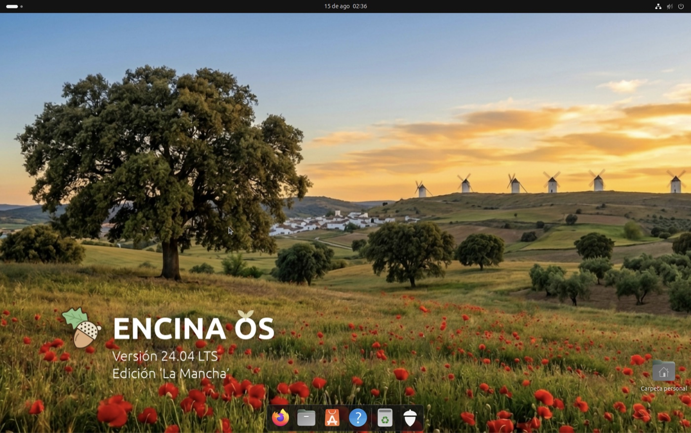
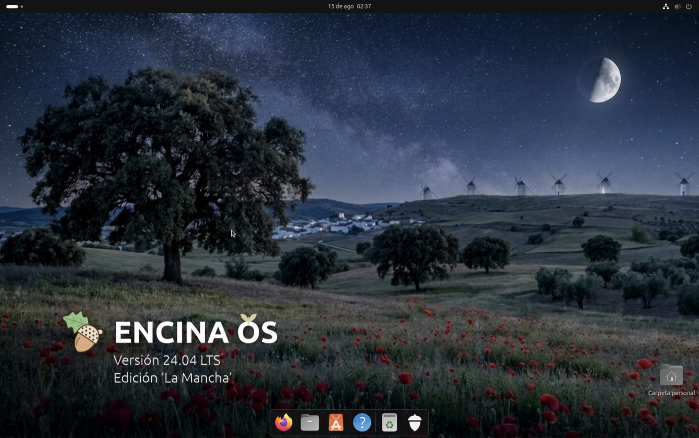

<p align="center">
  
</p>

<p align="center">
  <b>Una distribución derivada de Ubuntu con la firma digital española funcionando de fábrica.</b>
</p>

<p align="center">
  <a href="https://github.com/jmorenobl/encina-os/actions/workflows/build.yml"></a>
  <a href="LICENSE"></a>
  
  
  
</p>

<p align="center">
  <sub><b>Proyecto independiente.</b> Sin relación con la Administración General del Estado, la FNMT ni Canonical.<br>
  Derivado de Ubuntu; ni publicado ni avalado por Canonical Ltd.</sub>
</p>

---

## Qué es

Entrar en una sede electrónica con tu certificado, pulsar «Firmar» y que el
documento salga firmado. En Ubuntu recién instalado eso **no** funciona, y
arreglarlo a mano son cuatro cosas que hay que saber. En Encina OS viene hecho.

Es Ubuntu 24.04 LTS con cuatro paquetes encima y un instalador que los pone
solo. Nada más. Todo lo que hace está medido y escrito.

<p align="center">
  
  
</p>

<p align="center">
  <sub><b>El sistema ya instalado</b>, con <code>encina-branding</code> 0.1.13, en UTM arm64 el 2026-08-15.
  El fondo oscuro no es el claro atenuado: es el mismo paisaje de noche.<br>
  <b>El medio de instalación todavía no se ve así</b> —lleva marca de Ubuntu—, y esa es la tarea que bloquea publicar.<br>
  En el dock de estas dos capturas sale la «A» naranja del Centro de aplicaciones: <b>desde la 0.1.15 lleva icono propio</b>
  (<a href="design/capturas/despues/07-icono-tienda-aplicaciones.png">se ve aquí</a>). El «?» de la ayuda se queda como está, a propósito.<br>
  Los originales, en <a href="design/capturas/fondo-0.1.13/">design/capturas/fondo-0.1.13/</a>; aquí van reducidas.
  La aprobación visual es <code>[OJOS]</code> y no la da un guion.</sub>
</p>

## Cómo probarlo

**Todavía no hay una imagen que descargar.** La ISO existe, se instala sola en
nueve minutos y está verificada, pero **no está publicada**, y no por pereza:
faltan tres cosas concretas, y están abiertas con su motivo en
[TAREAS.md](TAREAS.md) — que **el medio se pueda fabricar sin partir de una ISO
anterior**, que **deje de llevar la marca de Ubuntu**, y **dónde vive un fichero
de 3,46 GB**, que no cabe en un release de GitHub. La cuarta, la de publicar las
fuentes, ya está hecha: está aquí abajo, en «Licencia y fuentes».

Lo que puedes hacer hoy, si quieres verlo funcionar:

```bash
git clone https://github.com/jmorenobl/encina-os
cd encina-os
./scripts/00-entorno.sh          # comprueba que tienes con qué construir
./scripts/03-construir.sh        # construye encina-branding
```

Y si lo que quieres es entender por qué no funcionaba y cómo se arregló, eso
está entero en [ENCINA-OS.md](ENCINA-OS.md) y [MEDICIONES.md](MEDICIONES.md).

## El estado, por delante y sin letra pequeña

Esto no son defectos: es dónde está el proyecto hoy. Lo que falta está en
[TAREAS.md](TAREAS.md) con su motivo.

| | Hoy | Cuándo |
|---|---|---|
| **Arquitectura** | **Solo arm64.** Si tu equipo es Intel o AMD, todavía no hay nada para ti | Sin fecha. No es prioridad |
| **Marca** | **El sistema instalado ya tiene cara propia** —fondos, GDM, arranque, la bellota en la rejilla y el Centro de aplicaciones con su icono—. **El medio no**: quien instala ve un instalador que dice Ubuntu | Es la prioridad siguiente, y es la que desbloquea publicar |
| **Instalación** | **Exige red.** El núcleo no viaja en el medio y lo baja el instalador | Límite declarado. Comprarlo cuesta 1 089 MB y saca la ISO del DVD de una capa |
| **Certificado** | Software, de la FNMT | DNIe con lector: incremento futuro |
| **Navegador** | Firefox | Chrome y Chromium no se han medido; no los des por buenos |
| **Secure Boot** | No se puede demostrar aquí | Límite declarado: el banco de pruebas no lo aplica |

## Qué trae puesto

Una instalación de Encina OS sale con esto, y **sin que nadie toque nada**:

- **AutoFirma 1.9.1** parcheado para que funcione con el Firefox de verdad
  —el de Mozilla, no el de Snap—, que es lo que hacía que la firma fallara en
  silencio.
- **Firefox nativo en español**, con el repositorio de Mozilla anclado. Un solo
  icono, y abre el nativo.
- **El visor de PDF atado**: un PDF abre en el visor, no en el navegador.
- **Escáner** (`simple-scan`) y **tienda de aplicaciones** (el Centro de
  aplicaciones), para que la máquina pueda crecer.
- **Todo en español**: sistema, instalador y aplicaciones.
- **Identidad propia en el sistema instalado**: fondos de día y de noche, tema de
  arranque, logotipo en la pantalla de inicio de sesión, la bellota en el botón
  de la rejilla y el Centro de aplicaciones con **icono de Encina** en vez de la
  «A» naranja de Ubuntu.

Lo que **no** trae, a propósito: ni suite ofimática ni cliente de correo. Se
instalan desde la tienda en un par de clics, y está medido que se puede.

## Cómo va el trabajo

| Etapa | Qué es | Estado |
|---|---|---|
| **E1** | Los cuatro paquetes, y una secuencia que los instala | **Hecho** |
| **E2** | Instalación desatendida con `autoinstall` | **Hecho, 6 de 6** |
| **E3** | Una ISO que se instala como se instala Ubuntu | **Hecho, 9 de 9**, con un límite declarado: exige red |
| **E4** | Lo que la distribución trae de serie | **Hecho, 13 de 13** |
| **E5** | Imagen propia (`live-build`/`debos`) y marca propia | Sin abrir — **es lo siguiente** |
| **E6** | amd64 | Sin abrir |

La lista de tareas concretas, en trozos que se puedan hacer de uno en uno, está
en **[TAREAS.md](TAREAS.md)**.

## Cómo está construido

Cuatro paquetes Debian y unos cuantos guiones. Los guiones son la parte que no
se puede teclear a mano dos veces igual:

```
imagen/construir-todo.sh          DE UN CLON A LA ISO, EN UNA SOLA ORDEN
imagen/traer-iso-oficial.sh       trae la ISO de Ubuntu y comprueba su FIRMA
imagen/cosechar-repo.sh           rehace el repositorio offline: los 28 .deb, por huella
imagen/repo-manifiesto.tsv        la lista de los 28, versionada -- la raiz de la circularidad
imagen/fabricar-iso.sh            construye la ISO a partir de la oficial de Ubuntu
imagen/fabricar-seed.sh           construye el volumen del instalador desatendido
imagen/encina-seed.sh             lo que corre dentro del instalador
imagen/autoinstall.yaml           el seed que viaja DENTRO de la ISO (pregunta, sin credenciales)
imagen/autoinstall-unattended.yaml  el seed desatendido, de laboratorio
imagen/verificar-instalacion.sh   comprueba la máquina que ha salido, con sus controles
```

## Construirla tú

**No hace falta ninguna ISO anterior**, y eso costó cerrarlo: hasta el
2026-08-13, para fabricar la ISO hacía falta *la ISO*, porque los 28 `.deb` del
repositorio offline sólo vivían dentro del medio. Ya no
(`MEDICIONES.md` §4.36–§4.39).

```
./imagen/traer-iso-oficial.sh            # la de Ubuntu, ~3,3 GiB, a medios/
./imagen/construir-todo.sh --constructor usuario@maquina-linux \
                           --autofirma <dir con autofirma_*.deb> \
                           --salida medios/encina-os.iso
```

Hacen falta **dos máquinas** y no es un capricho: `dpkg-buildpackage` y
`dpkg-scanpackages` no existen en macOS, y `fabricar-iso.sh` usa herramientas de
macOS. El constructor es cualquier Ubuntu 24.04 arm64 con `ssh`.

`medios/` está en `.gitignore`: la ISO son 3,3 GiB y no viaja en el clon, pero
**la orden de traerla sí** — y con ella el instrumento que sabe decir
`[RETIRADO]` el día que Canonical la quite del archivo. Ver `medios/LEEME.md`.

**Se comprueba a sí misma, y de las dos maneras.** `fabricar-iso.sh` compara la
ISO construida contra la oficial **fichero a fichero**, verifica que los tres
binarios firmados del arranque siguen intactos y se niega si cambió algo que no
debía. Y `construir-todo.sh` construye **lo versionado y no tu directorio de
trabajo**, así que se niega sobre un árbol sucio. **Dos pasadas seguidas dan la
misma huella**: medido cinco veces el 2026-08-13, con los `.deb` viniendo unas
de un runner amd64 y otras de una máquina arm64.

*Lo que no está medido, dicho aquí y no en letra pequeña:* **ninguna de esas
cinco ISOs se ha arrancado.** Lo comprobado es que el medio se **fabrica** igual,
no que funcione.

## Documentación

Este proyecto escribe lo que mide, incluido lo que sale mal.

| Documento | Para qué |
|---|---|
| **[TAREAS.md](TAREAS.md)** | Lo que queda por hacer, en trozos |
| **[ENCINA-OS.md](ENCINA-OS.md)** | Qué es el producto y qué se ha decidido, con el motivo |
| **[MEDICIONES.md](MEDICIONES.md)** | Cada medición con sus salidas literales y sus controles |
| **[SCRIPTS.md](SCRIPTS.md)** | Cómo se usan los guiones, y las trampas que costaron una vuelta |
| **[AGENTS.md](AGENTS.md)** | Las definiciones de terminado, casilla a casilla |
| **[DIARIO.md](DIARIO.md)** | Qué se hizo cada día |

## Licencia y fuentes

El código de este repositorio se publica bajo **EUPL-1.2** (ver [LICENSE](LICENSE)).

### La fuente correspondiente, sin pedirla

El AutoFirma que se instala **no es el oficial**: es la versión 1.9.1 con un
parche. Distribuir una imagen que lo lleva obliga a ofrecer con qué
reconstruirlo, y esa oferta no es una dirección de correo: es esta tabla.

| Qué | Dónde | Anclado en |
|---|---|---|
| El empaquetado y **el parche** | [jmorenobl/encina-autofirma](https://github.com/jmorenobl/encina-autofirma) — `debian/patches/0001-perfiles-mozilla-todas-las-rutas.patch` | `main` |
| AutoFirma | [jmorenobl/clienteafirma](https://github.com/jmorenobl/clienteafirma) | `v1.9.1` |
| jmulticard | [jmorenobl/jmulticard](https://github.com/jmorenobl/jmulticard) | `v2.1` |
| Bibliotecas externas | [jmorenobl/clienteafirma-external](https://github.com/jmorenobl/clienteafirma-external) | `v1.0.7` |
| Los tres paquetes de Encina | este repositorio, en [debian-packages/](debian-packages/) | — |
| Todo lo demás | Ubuntu 24.04 LTS y Mozilla, **sin modificar**. Los 28 `.deb` que viajan, con versión y huella, en [imagen/repo-manifiesto.tsv](imagen/repo-manifiesto.tsv) | — |

Que la oferta funciona no es una promesa: la CI de `encina-autofirma` hace
exactamente eso en cada `push` —clona los tres forks por su tag, construye el
`.deb` y lo verifica— y está en verde.

Y una advertencia que va con la oferta: ese AutoFirma parcheado **no es una
versión mejor** que el oficial. Es una muleta, con su condición de retirada
escrita y comprobable con una orden — ver
[cuándo se retira](https://github.com/jmorenobl/encina-autofirma#cuándo-se-retira-este-repositorio).
Si el oficial te funciona, usa el oficial.

### Marcas

Encina OS está construido sobre Ubuntu 24.04 LTS. Ubuntu es una marca registrada
de Canonical Ltd. Encina OS no está afiliado a Canonical Ltd. ni avalado por
ella.

Esas tres frases no son una cortesía: son **la forma exacta** que fija
[ENCINA-OS.md](ENCINA-OS.md) **D22**, tras leer la *IPRights Policy* de Canonical
—citada literalmente en su §2.1—. La política **no autoriza ninguna fórmula**;
concede referenciar Ubuntu sin implicar aval, y ésta es la nuestra para caber
ahí.

Y hoy el medio todavía lleva marca de Ubuntu: sustituirla por la propia es la
tarea que bloquea publicar la imagen, y está la primera en
[TAREAS.md](TAREAS.md).

AutoFirma es del Ministerio para la Transformación Digital. La versión que viaja
aquí está **parcheada** y por eso no es la oficial; el motivo y el parche están
en [ENCINA-OS.md](ENCINA-OS.md).
