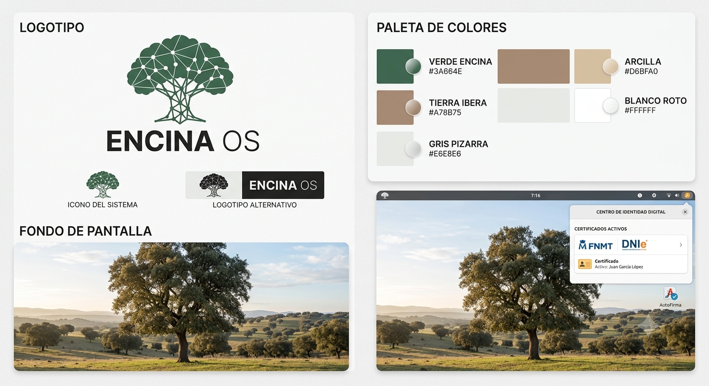

<p align="center">
  
</p>

<p align="center">
  <a href="https://github.com/jmorenobl/encina-os/actions/workflows/build.yml"></a>
  <a href="LICENSE"></a>
  
  
  
</p>

<p align="center">
  <sub><b>Proyecto independiente.</b> Sin relación con la Administración General del Estado, la FNMT ni Canonical.<br>
  Derivado de Ubuntu; ni publicado ni avalado por Canonical Ltd.</sub>
</p>

---

## Qué te aporta

En Encina OS, hacer una gestión electrónica con la administración española
—entrar en la sede con tu certificado, pulsar «Firmar» y que el documento salga
firmado— **funciona desde el primer arranque**. Sin buscar en foros, sin tocar
`about:config`, sin entender qué es un perfil de Mozilla ni por qué importa que
Firefox venga en Snap.

**Y el perímetro va por delante y no en la letra pequeña, porque aquí lo que no
se mide no se da por bueno:**

| | Medido | Todavía no |
|---|---|---|
| **Certificado** | Software, de la FNMT | DNIe con lector (`opensc`, PKCS#11): incremento futuro, no deuda |
| **Navegador** | Firefox | Chrome y Chromium no se han medido, así que no los des por buenos |
| **Arquitectura** | arm64 | amd64 — si tu equipo es Intel o AMD, todavía no hay nada para ti |

Hay además un límite que **no cierra ningún equipo, sea el que sea**: algunas
sedes bloquean con su propia política de seguridad el `iframe` que su propio
JavaScript necesita (B5). Eso se arregla en la sede, no en tu máquina.

**Y hoy no hay imagen publicada**, así que esto todavía no te lo puedes
descargar: lo que hay es la receta, medida de extremo a extremo.
[Qué falta para llegar ahí](#cómo-se-usa).

---

## Por qué no funcionaba

Desde una Ubuntu recién instalada, no funciona. Instalas AutoFirma, el
instalador dice «éxito», la herramienta de reparación oficial dice que tu
sistema está sano, pulsas «Firmar» y **no ocurre absolutamente nada**: sin
diálogo, sin error, sin una línea en el registro del sistema.

Debajo hay **seis obstáculos encadenados, cada uno capaz de esconder al
siguiente**, medidos en máquina propia y no citados de nadie. Los cierra el
sistema, no tú. [La tabla completa está más abajo](#el-problema-que-resuelve).

---

## Cómo se usa

**Hoy no se puede usar todavía.** No hay imagen publicada, no hay instalador y no
hay paquetes descargables. El problema principal está resuelto y medido —el 7 de
agosto de 2026 salió la primera firma real de extremo a extremo, con certificado
de la FNMT sobre una sede real, y el 9 de agosto una máquina **virgen**,
instalada solo con las tres órdenes de más abajo, firmó sin que hubiera que
tocarle nada más—, pero lo que hay es la receta, no el producto.

### Cómo se espera que se use

Cuando esté, el uso previsto es este y no otro:

1. Descargas una imagen ISO de Encina OS.
2. La instalas como instalarías Ubuntu.
3. Entras, abres la sede electrónica, pulsas «Firmar», y firma.

No hay paso 4. **No se instala sobre tu Ubuntu actual**: lo que se entrega es el
sistema. Los `.deb` de este repositorio son ingredientes del producto, no un
producto que puedas aplicar a una máquina que ya tienes.

### Qué falta para llegar ahí

| Hito | Qué te daría | Estado |
|---|---|---|
| **E1** — `encina-meta` | Un solo nombre que declara el conjunto | **Hecho, 12 de 12.** La que decide: una máquina virgen instalada con la secuencia firma de verdad. La última casilla se cerró ya dentro de E2 |
| **E2** — Instalación desatendida | Un `autoinstall.yaml` que monta el sistema solo | **Hecho, 6 de 6 (10 de agosto de 2026).** Una máquina se instala sola en menos de 11 minutos: los cuatro paquetes desde un repositorio que viaja **dentro del propio volumen del seed**, **sin el Snap de Firefox**, y Firefox de Mozilla en español. La ISO oficial no se toca. Y la casilla que decide, marcada: **una firma real en `valide.redsara.es`** sobre un clon de esa máquina, destruido después |
| **E3** — ISO que se instala como Ubuntu | **Aquí es donde lo puedes usar tú:** una ISO que le puedes dar a alguien | **Abierto el 10 de agosto de 2026.** **Se instala como se instala Ubuntu:** te pregunta teclado, red, disco, usuario y zona horaria, y lo único que trae puesto de fábrica es Encina — el repositorio con los cuatro paquetes, sin el Snap de Firefox, y Firefox nativo en español. **No lleva ningún usuario ni ninguna contraseña dentro:** los pones tú al instalar. **Dos cosas no se preguntan, a propósito, porque son el producto y no una preferencia:** el sistema se instala **en español** y sobre la **instalación mínima** de Ubuntu — Encina OS se construye encima de esa base, y lo que se le añada se declarará en `encina-meta` (E4). El seed va **dentro** de la ISO, donde el instalador lo busca (`/cdrom/autoinstall.yaml`). Falta lo caro: reempaquetar la imagen sin romperla. **Con una limitación dicha por delante:** las máquinas virtuales del autor **no aplican Secure Boot**, así que aquí no se puede demostrar que la ISO arranque en un equipo que sí lo tenga activo |
| **E4** — Aplicaciones de serie | Un escritorio completo, no solo la firma | Sin abrir |
| **E5** — Imagen propia | El destino declarado: instalador propio y control del conjunto base | Sin abrir |
| **E6** — amd64 | **Si tu equipo es Intel o AMD, lo necesitas** | Sin abrir |

Detalle y motivos en [ENCINA-OS.md](ENCINA-OS.md) §6.

**Y una advertencia sobre la arquitectura.** Hoy Encina OS solo existe para
**arm64**, que es lo único que el autor puede probar. Si tu equipo es un PC
normal, todavía no hay nada para ti; amd64 llegará cuando haya con qué medirlo.

### Qué sí puedes hacer hoy

Si quieres verlo funcionando, se puede reproducir sobre una **Ubuntu 24.04 arm64
limpia** —una VM, no tu máquina—, construyendo los paquetes tú mismo:

```
# 1. los cuatro .deb, con el de autofirma puesto al lado
sudo apt install ./encina-meta_*.deb ./encina-branding_*.deb \
                 ./encina-firefox-native_*.deb ./autofirma_*.deb
# 2. hasta aqui el repositorio de Mozilla existe pero apt no lo ha leido
sudo apt update
# 3. el cambio de Snap a nativo, y el idioma, que ningun Depends: puede declarar
sudo apt full-upgrade          # 'apt upgrade' NO hace este paso
sudo apt install firefox-l10n-es-es
```

Con la secuencia y las advertencias que van con ella:

- **Son tres órdenes y no una**, y eso está medido, no es un descuido: el motivo
  de cada paso está en [MEDICIONES.md](MEDICIONES.md) §4.10 y §4.12. **Hubo un
  cuarto paso** entre el 2026-08-08 y el 2026-08-09 —abrir Firefox y
  `sudo dpkg-reconfigure autofirma`—, y se ha caído porque el paquete de
  AutoFirma aprendió a hacerlo solo: ahora instala la CA de su socket **cuando
  aparece el perfil de Firefox**, que es horas después de instalarse.
- **Tres de los cuatro `.deb` se construyen desde este repositorio**, con los
  scripts de [más abajo](#cómo-construir-y-probar).
- **El cuarto, `autofirma 1.9.1+encina2`, vive en `encina-autofirma`, que hoy es
  un repositorio privado.** Se hará público cuando se publique la imagen: hacerlo
  antes activa obligaciones de mantenimiento hacia un público que ahora mismo es
  el autor ([ENCINA-OS.md](ENCINA-OS.md), D5). Mientras tanto, esta secuencia no
  la puede completar alguien de fuera.

---

## El problema que resuelve

| # | Obstáculo | Quién lo cierra en Encina OS |
|---|---|---|
| B1a | Las preferencias del esquema `afirma:` están donde la compilación de Mozilla no las lee | `autofirma 1.9.1+encina2` |
| B1b | La preferencia con la que AutoFirma lanza el programa ya no existe en Firefox 153 | `autofirma 1.9.1+encina2` |
| B2 | El certificado del canal seguro se instala en el perfil de navegador equivocado | `autofirma 1.9.1+encina2` |
| B3 | Dentro del Snap, Firefox **no ve** el programa que debería abrir | `encina-firefox-native`, y quitar el Snap en la imagen |
| B4 | AutoFirma busca tu certificado en el perfil del Snap, que está vacío | `autofirma 1.9.1+encina2`, y quitar el Snap lo cierra solo |
| B6 | Las bibliotecas NSS no se encuentran fuera de x86 | `autofirma 1.9.1+encina2` |

Hay un séptimo, B5, que **no lo puede cerrar nadie desde el equipo**: algunas
sedes electrónicas bloquean con su propia política de seguridad el `iframe` que
su propio JavaScript necesita.

Las salidas literales de todas estas mediciones están en
[MEDICIONES.md](MEDICIONES.md).

### El AutoFirma corregido, y por qué es temporal

El `.deb` oficial de AutoFirma tiene errores medidos: un campo mal escrito que
deja el entorno de ejecución de Java sin declarar, un `postinst` que declara
éxito con todo roto, el certificado del canal seguro en el perfil equivocado, y
rutas de bibliotecas escritas a mano que solo cubren x86.

Las correcciones se han propuesto al **repositorio oficial**, que es el único
sitio desde el que llegan a todo el mundo. Mientras no las incorporen, Encina OS
usa su propio paquete construido desde las fuentes oficiales.

**Ese paquete es un puente y se retira**, y la condición no es una fecha: es que
el `.deb` que publica la Administración pase la misma batería de comprobaciones
que pasa el nuestro.

---

## Estado actual

| Pieza | Estado |
|---|---|
| `encina-branding` | **Terminado.** v0.1.7, identidad visual: fondos, tema de Plymouth, logotipo de GDM |
| `encina-firefox-native` | **Terminado.** v0.2.1, Firefox de Mozilla en lugar del Snap, con repositorio, clave verificada por huella y anclaje. Desde el 10 de agosto de 2026 el usuario ve **un solo icono de Firefox** y no dos |
| `autofirma 1.9.1+encina2` | **Terminado y con el primer positivo de extremo a extremo.** En un repositorio aparte, con CI verde en amd64 y arm64 |
| `encina-meta` | **Terminado, 12 de 12.** v0.1.1, construido y verificado en VM. El 9 de agosto de 2026, sobre una máquina virgen instalada con las tres órdenes de abajo **y nada más**, salió una firma real en una sede de verdad, mirada en pantalla. La última casilla (`autoremove`) no era cumplible con `.deb` sueltos y se cerró con el repositorio local de la instalación desatendida |
| Instalación desatendida | **Terminada, 6 de 6 (10 de agosto de 2026).** `imagen/autoinstall.yaml` sobre la ISO oficial de Ubuntu, sin tocarla: repositorio local con los cuatro `.deb` dentro del propio volumen del seed, `encina-meta`, **sin Snap**, y Firefox de Mozilla en español. Medido el 10 de agosto de 2026: **menos de 11 minutos y nadie tocó nada**. **Y esa misma tarde salió la firma** en `valide.redsara.es`, sobre un clon efímero de esa máquina que se destruyó después: el navegador que firmó era el nativo, fuera de `/snap/`, y la CA de AutoFirma estaba donde tenía que estar, comprobada por huella |
| Imagen | Sin abrir |

**Arquitectura: solo arm64 por ahora.** Es lo único que se puede medir con el
equipo disponible, y en este proyecto lo que no se mide no se da por bueno. La
integración continua construye en amd64 porque el runner lo es, pero eso no es
lo mismo que declararlo probado.

---

## Qué es, y qué no es

**Qué es:**

- **Una distribución**, no un fork: `ID=ubuntu` intacto, repositorios de Ubuntu
  intactos, `ubuntu-desktop-minimal` como base.
- **Cuatro paquetes**, tres en este repositorio y uno en otro. Se construyen
  `.deb`; lo que se entrega es Ubuntu LTS con esos paquetes aplicados. La base no
  se remasteriza: se hereda de Ubuntu toda la capa de actualizaciones y
  aplicaciones.
- **Reproducible y declarativo.** Todo en git; nada editado a mano dentro de un
  chroot.

**Qué no es:**

- **No es una herramienta que instales sobre tu Ubuntu.** Lo que se entrega es el
  sistema. Los `.deb` son ingredientes, no producto.
- **No hay imagen publicada todavía.** Hoy solo existe para arm64, y publicar una
  imagen que casi nadie puede arrancar activa obligaciones de mantenimiento sin
  dar nada a cambio.
- **No incluye estética de terceros.** Ni marca de Canonical, ni tipografías
  propietarias, ni iconos que imiten a otros sistemas.
- **No pretende ser un proyecto grande.** Es de una sola persona, y crece por
  incrementos que dejan un sistema usable cada uno.

---

## Cómo construir y probar

Esta sección es para quien quiera trabajar sobre el proyecto, no para usarlo.

### Entorno

Los paquetes se construyen y se prueban **en una VM Ubuntu**, no en el Mac. El
entorno del autor es un repositorio en macOS montado por 9p dentro de una VM
Ubuntu 24.04 arm64 en UTM, de modo que se edita en el Mac y se ejecuta en la VM:

```
ssh USUARIO@IP-DE-TU-VM "cd /mnt/encina && ENCINA_REPO=/mnt/encina ./scripts/03-construir.sh"
```

`ENCINA_REPO` indica dónde está el repositorio; su valor por defecto es
`~/encina`. Los scripts no asumen nada más sobre la máquina.

### Scripts

Catorce scripts, en orden. Cada uno termina diciendo cuál viene después y
ninguno da nada por bueno sin comprobarlo. Detalle en [SCRIPTS.md](SCRIPTS.md).

| Script | Qué hace |
|---|---|
| `00-entorno.sh "Nombre" "correo"` | Instala herramientas de empaquetado, configura git y `DEBEMAIL` |
| `01-repo.sh` | Coloca el esqueleto del paquete y verifica el árbol de ficheros |
| `02-activos.sh` | Genera los activos gráficos mínimos y verifica sus formatos |
| `03-construir.sh` | Comprueba las reglas duras, construye el `.deb` y pasa `lintian` |
| `04-instalar.sh` | Instala y comprueba todo lo verificable sin reiniciar |
| `05-verificar.sh` | Usuario nuevo, idempotencia ×5, purga |
| `06-ci.sh` | Flujo de GitHub Actions y repositorio remoto |
| `07-firefox-construir.sh` | Huella de la clave de Mozilla, reglas duras, `.deb` y `lintian` |
| `08-firefox-instalar.sh` | Instala, `apt update`, anclaje, idioma y Firefox nativo |
| `09-firefox-verificar.sh` | `full-upgrade` ×2, idempotencia ×5, purga |
| `10-meta-construir.sh` | Reglas duras de `encina-meta`, `.deb` y `lintian` |
| `11-meta-instalar.sh` | La secuencia de órdenes, comprobada paso a paso |
| `12-meta-verificar.sh` | Idempotencia ×5, purga y `autoremove` |
| `diario.sh "texto"` | Añade una entrada fechada a `DIARIO.md` y hace commit |

Del 00 al 06 sirven para `encina-branding` y son de uso común; del 07 al 09, para
`encina-firefox-native`; del 10 al 12, para `encina-meta`. Los seis últimos son
scripts aparte y no una generalización de 03/04/05 a propósito: aquellos están
validados y no se tocan.

Ruta corta, con el entorno ya preparado:

```
./scripts/03-construir.sh     # build + lintian + reglas duras
./scripts/04-instalar.sh      # instalar y comprobar en caliente
sudo reboot
./scripts/05-verificar.sh     # las pruebas que de verdad importan

./scripts/07-firefox-construir.sh
./scripts/08-firefox-instalar.sh
./scripts/09-firefox-verificar.sh    # full-upgrade x2: la prueba del anclaje

./scripts/10-meta-construir.sh
./scripts/11-meta-instalar.sh        # las ordenes, comprobadas una a una
./scripts/12-meta-verificar.sh
```

Todos son idempotentes. `02-activos.sh` no sobrescribe activos existentes salvo
con `--forzar`, para que el día que estén los definitivos no los machaque un
script.

### Cómo leer la salida

```
[OK]     comprobado y correcto
[FALLO]  comprobado e incorrecto, con la salida literal del comando
[AVISO]  algo que mirar, no bloquea
[OMIT]   no se ha comprobado (no lo des por bueno)
[OJOS]   solo lo puedes verificar tú mirando la pantalla
```

Un solo `[FALLO]` hace que el script salga con código distinto de cero. Las
marcas `[OJOS]` no cuentan como aprobadas: el splash de arranque, el logotipo de
GDM, el fondo del escritorio, que Firefox arranque en español y que salga una
firma real hay que mirarlos.

**Y la regla que ha salido más cara de aprender:** una comprobación que pasa no
vale nada si no sabes contra qué ha pasado. Cuando una dé `[OK]`, comprueba que
habría dado `[FALLO]` de haber estado mal. [SCRIPTS.md](SCRIPTS.md) recoge siete
trampas reales, todas encontradas en este proyecto, y las siete producen falsos
negativos o comprobaciones que no comprueban nada.

### Reglas duras

Diez invariantes (R1–R10) recogidas en [AGENTS.md](AGENTS.md) §2, desde «nada de
`/etc/skel`» hasta «sin dependencias circulares de repositorio».
`03-construir.sh` comprueba estáticamente las que puede —R1, R2, R3, R6, R7, el
callback de contraseña de LUKS, la presencia de `picture-uri-dark` y la línea
duplicada de `GRUB_DISTRIBUTOR`— antes de dejar construir nada. Son justo los
fallos que en caliente resultan invisibles y solo aparecen al reiniciar, o solo
en máquinas con disco cifrado.

`07-firefox-construir.sh` hace lo propio con las que aplican a Firefox nativo
—R3, R4, R10— y añade la que puede detener la fase entera: la huella de la clave
de firma de Mozilla. Si no coincide con
`35BAA0B33E9EB396F59CA838C0BA5CE6DC6315A3`, no construye nada y manda avisar.

---

## Estructura del repositorio

```
debian-packages/
  encina-branding/
    debian/       # changelog (con dch, nunca a mano), control, copyright,
                  # rules, postinst, prerm, postrm
    src/          # árbol que se copia tal cual a la raíz del sistema
  encina-firefox-native/
    debian/       # changelog, control, copyright, rules, lintian-overrides
                  # (sin scripts de mantenedor: no hay nada que ejecutar)
    src/          # mozilla.sources, encina-mozilla y la clave de firma
  encina-meta/
    debian/       # solo control, rules, copyright y changelog.
                  # Ni src/, ni scripts de mantenedor, ni overrides de lintian:
                  # un metapaquete con contenido son dos paquetes mal separados
scripts/          # los catorce scripts + lib.sh
imagen/           # la receta de la instalación desatendida
  autoinstall.yaml    # el seed que se sirve en un volumen CIDATA
  encina-seed.sh      # el fuente legible de la late-command que hace el trabajo
  meta-data
  fabricar-seed.sh    # fabrica el volumen, comprobando los .deb por huella
  verificar-e2.sh     # verifica la máquina que sale, con sus controles
.github/workflows/build.yml
```

Los artefactos de construcción (`.deb`, `.buildinfo`, `.changes`) no se
versionan. El código y los activos sí.

## Identidad visual

<p align="center">
  
</p>

Una encina cuya copa y raíces son una red de nodos: el árbol de la dehesa
española y la red de confianza que hace posible una firma electrónica, que son
las dos cosas de las que va el proyecto.

| Color | Hex |
|---|---|
| Verde encina | `#3A664E` |
| Tierra íbera | `#A78B75` |
| Arcilla | `#D6BFA0` |
| Gris pizarra | `#E6E8E6` |
| Blanco roto | `#FFFFFF` |

**Procedencia de los activos**, que R8 exige declarar:

- **Logotipo y banner:** generados con Google Gemini a partir de indicaciones
  propias. Ninguna marca de terceros forma parte de ellos.
- **Fondos de pantalla:** fotografías de **Amanda Anusane** publicadas en
  Unsplash bajo la Unsplash License. Es una licencia permisiva pero **no es una
  licencia libre al uso** —prohíbe vender copias sin modificar y compilar las
  fotos para replicar un servicio competidor—, así que se declara como párrafo
  propio en el `debian/copyright` del paquete que las distribuya. La atribución
  no es obligatoria; se hace igualmente.

## Documentación

| Documento | Para qué |
|---|---|
| [ENCINA-OS.md](ENCINA-OS.md) | Documento maestro: qué es, decisiones cerradas, hoja de ruta y siguiente acción. Si los documentos se contradicen, manda este |
| [AGENTS.md](AGENTS.md) | Fuente de verdad de la implementación: reglas duras, convenciones y especificación de cada paquete, con su definición de terminado |
| [MEDICIONES.md](MEDICIONES.md) | Lo medido, con las salidas literales de los comandos. Antes de investigar algo, mirar aquí |
| [SCRIPTS.md](SCRIPTS.md) | Qué hace cada script, en qué orden, y las dieciocho trampas |
| [DIARIO.md](DIARIO.md) | Dónde se quedó el trabajo |

## Licencia

EUPL-1.2. El fichero [LICENSE](LICENSE) contiene el **texto oficial completo**:
los quince artículos y el Apéndice de licencias compatibles.

Verificado carácter a carácter contra la publicación de la Unión Europea en
EUR-Lex —la EUPL v1.2 es el anexo de la Decisión de Ejecución (UE) 2017/863—
ignorando solo espaciado y comillas tipográficas: 10.956 caracteres idénticos.

Ninguna **marca** de terceros forma parte del proyecto: ni logotipos de Canonical
o Ubuntu, ni emblemas institucionales, ni tipografías propietarias, ni iconos que
imiten a otros sistemas (R8). Los activos gráficos que **sí** vienen de fuera son
las fotografías de los fondos de pantalla, con su licencia y su autoría
declaradas arriba, que es lo que R8 permite y exige.

El único fichero de terceros que se distribuye es la **clave pública de firma
del repositorio APT de Mozilla**, dentro de `encina-firefox-native`. Se incluye
íntegra y sin modificar, verificada contra su huella, y está declarada como tal
en el `debian/copyright` de ese paquete, que es lo que R8 exige. Una clave
pública se publica precisamente para ser copiada: es el único modo de que sirva
para verificar firmas.

AutoFirma es software libre de la Administración General del Estado (GPL 2+ y
EUPL 1.1) y es redistribuible. El paquete corregido se construye desde sus
fuentes oficiales y las correcciones están propuestas al repositorio de origen.
